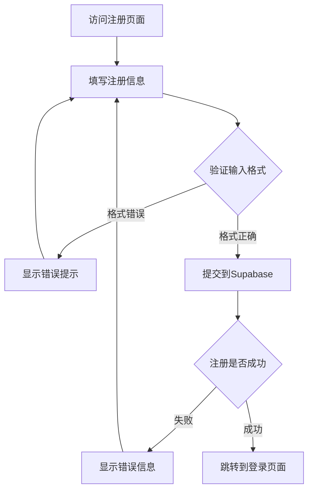
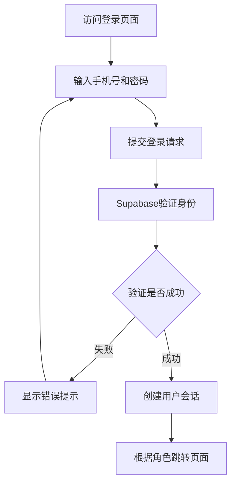
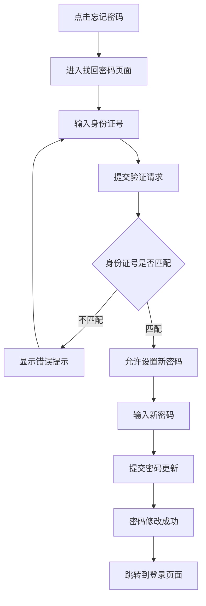

# 通用工时管理系统 - 产品需求文档

## 1. 产品概述

通用工时管理系统是一个面向企业和员工的工时记录与管理平台，支持PC端和移动端响应式访问。系统提供用户注册、登录、信息管理等功能，帮助企业实现工时数据的统一管理和角色权限控制。

主要功能：
- 用户注册与身份验证
- 多角色权限管理
- 用户、公司、角色信息管理
- 响应式设计，适配PC和移动设备

## 2. 核心功能

### 2.1 用户角色

| 角色 | 注册方式 | 核心权限 |
|------|---------|---------|
| 普通用户 | 手机号注册 | 查看个人信息、公司信息 |
| 企业管理员 | 手机号注册 | 管理公司信息、查看员工信息 |
| 系统管理员 | 手机号注册 | 管理所有用户、公司、角色 |

### 2.2 功能模块

1. **登录页面**：手机号密码登录入口
2. **注册页面**：新用户账号创建
3. **找回密码页面**：通过身份证号重置密码
4. **用户信息模块**：个人信息查看与编辑
5. **公司信息模块**：企业信息查看与管理
6. **角色信息模块**：角色权限查看与管理

### 2.3 页面详情

| 页面名称 | 模块名称 | 功能描述 |
|---------|---------|---------|
| 登录页面 | 登录表单 | 手机号、密码输入，登录按钮，跳转注册和找回密码链接 |
| 登录页面 | 品牌展示 | 系统Logo、名称、简介 |
| 注册页面 | 注册表单 | 手机号、身份证号、真实姓名、公司名称、角色选择、密码、确认密码输入 |
| 注册页面 | 表单验证 | 实时验证输入格式，手机号、身份证号格式校验 |
| 找回密码页面 | 身份验证 | 输入身份证号验证身份 |
| 找回密码页面 | 密码重置 | 输入新密码并确认 |
| 用户信息模块 | 信息展示 | 显示手机号、身份证号、真实姓名、公司名称、角色 |
| 用户信息模块 | 信息编辑 | 修改个人信息（除身份证号外） |
| 公司信息模块 | 信息展示 | 显示公司名称、统一社会信用代码、法人、地址等 |
| 公司信息模块 | 信息编辑 | 管理员可修改公司信息 |
| 角色信息模块 | 角色列表 | 显示系统所有角色及权限 |
| 角色信息模块 | 角色详情 | 查看角色详细权限配置 |

## 3. 核心流程

### 3.1 用户注册流程

用户访问系统，点击注册按钮进入注册页面。填写手机号、身份证号、真实姓名、公司名称、选择角色、设置登录密码。系统验证手机号格式、身份证号格式、密码强度。验证通过后，将用户信息存储到Supabase数据库，注册成功自动跳转到登录页面。

### 3.2 用户登录流程

用户在登录页面输入手机号和密码。系统调用Supabase Authentication进行身份验证。验证成功后，生成用户会话，根据用户角色跳转到对应的信息展示页面。验证失败则显示错误提示。

### 3.3 密码修改流程

用户点击"忘记密码"链接，进入找回密码页面。输入身份证号进行身份验证。系统验证身份证号与数据库中记录匹配后，允许用户设置新密码。新密码保存成功后，跳转到登录页面。

## 4. 用户界面设计

### 4.1 设计风格

- **主色调**：深蓝色 (#1e40af) 作为主色，代表专业、可信
- **辅助色**：浅蓝色 (#3b82f6) 用于按钮和交互元素
- **背景色**：浅灰色 (#f9fafb) 背景，白色卡片
- **字体**：系统默认字体栈，中文使用"思源黑体"或"微软雅黑"
- **按钮样式**：圆角矩形，轻微阴影，悬停时颜色加深
- **布局风格**：卡片式布局，顶部导航栏，内容居中
- **图标风格**：简洁线条图标，使用Lucide React图标库

### 4.2 页面设计概览

| 页面名称 | 模块名称 | UI元素 |
|---------|---------|--------|
| 登录页面 | 品牌展示 | 居中Logo，系统名称，简洁介绍文字 |
| 登录页面 | 登录表单 | 白色卡片，手机号输入框（带图标），密码输入框（带图标），登录按钮，底部链接 |
| 登录页面 | 背景 | 渐变背景，从深蓝到浅蓝，带轻微纹理 |
| 注册页面 | 注册表单 | 白色卡片，多行输入框，角色选择下拉框，密码强度指示器，注册按钮 |
| 注册页面 | 表单验证 | 实时错误提示，红色边框，错误图标 |
| 找回密码页面 | 身份验证 | 白色卡片，身份证号输入框，验证按钮 |
| 找回密码页面 | 密码重置 | 新密码输入框，确认密码输入框，提交按钮 |
| 用户信息模块 | 信息展示 | 卡片式布局，头像区域，信息列表（标签+值），编辑按钮 |
| 用户信息模块 | 信息编辑 | 表单模式，输入框可编辑，保存/取消按钮 |
| 公司信息模块 | 信息展示 | 公司Logo，公司名称，详细信息列表 |
| 公司信息模块 | 信息编辑 | 管理员权限下显示编辑功能 |
| 角色信息模块 | 角色列表 | 卡片网格布局，每个角色一个卡片，显示角色名称和权限摘要 |
| 角色信息模块 | 角色详情 | 点击卡片展开详情，显示完整权限列表 |

### 4.3 响应式设计

- **桌面端优先**：设计以桌面端为主，最小宽度1280px
- **移动端适配**：
  - 断点设置：768px（平板）、480px（手机）
  - 导航栏：桌面端水平导航，移动端汉堡菜单
  - 表单布局：桌面端双列或三列，移动端单列
  - 卡片布局：桌面端网格排列，移动端垂直堆叠
  - 字体大小：移动端适当缩小，保证可读性
  - 触摸优化：按钮最小高度44px，间距适当
- **交互优化**：
  - 移动端减少悬停效果
  - 增大点击区域
  - 优化表单输入体验（自动聚焦、输入提示）

### 4.4 视觉细节

- **阴影效果**：卡片使用轻微阴影（box-shadow: 0 1px 3px rgba(0,0,0,0.1)）
- **圆角设计**：卡片圆角8px，按钮圆角6px，输入框圆角4px
- **过渡动画**：按钮悬停、卡片展开使用0.2s平滑过渡
- **加载状态**：按钮加载时显示旋转图标，禁用点击
- **错误提示**：红色文字，带警告图标，出现在输入框下方
- **成功提示**：绿色文字，带对勾图标，出现在表单顶部
