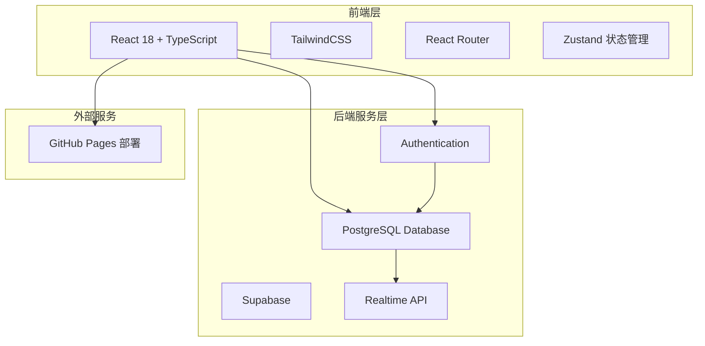

# 通用工时管理系统 - 技术架构文档

## 1. 架构设计



## 2. 技术说明

- **前端**: React@18 + TypeScript + TailwindCSS + Vite
- **初始化工具**: create-vite (npm create vite@latest)
- **后端**: Supabase (BaaS - Backend as a Service)
- **数据库**: PostgreSQL (Supabase 托管)
- **认证**: Supabase Authentication (邮箱/密码认证)
- **状态管理**: Zustand (轻量级状态管理)
- **路由**: React Router v6
- **图标**: Lucide React
- **表单验证**: React Hook Form + Zod
- **部署**: GitHub Pages

## 3. 路由定义

| 路由 | 用途 |
|------|------|
| `/` | 登录页面 |
| `/register` | 注册页面 |
| `/forgot-password` | 忘记密码页面 |
| `/dashboard` | 仪表盘主页（需认证） |
| `/profile` | 用户信息模块（需认证） |
| `/company` | 公司信息模块（需认证） |
| `/roles` | 角色信息模块（需认证） |

## 4. API定义

### 4.1 用户认证接口

```typescript
// 用户注册
interface RegisterRequest {
  phone: string;          // 手机号
  idCard: string;         // 身份证号
  realName: string;       // 真实姓名
  companyName: string;    // 公司名称
  role: string;          // 角色：'user' | 'admin' | 'super_admin'
  password: string;       // 密码
}

interface RegisterResponse {
  success: boolean;
  message: string;
  userId?: string;
}

// 用户登录
interface LoginRequest {
  phone: string;
  password: string;
}

interface LoginResponse {
  success: boolean;
  message: string;
  user?: User;
  token?: